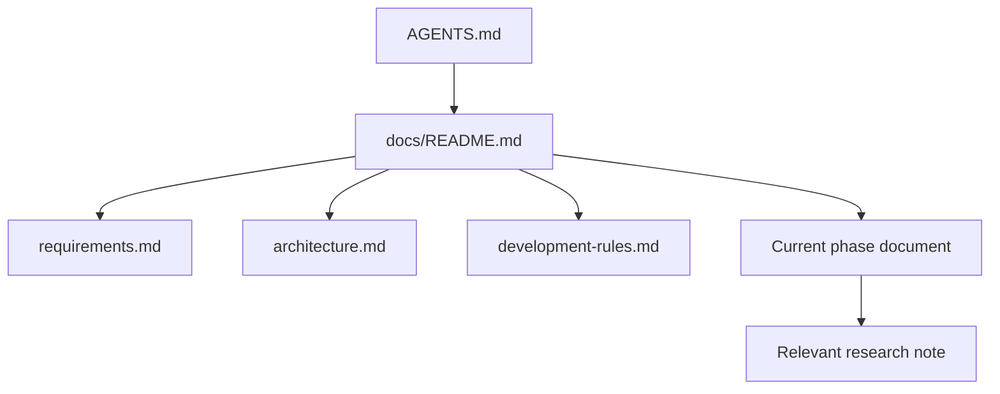

# Documentation map

`AGENTS.md` is the short entry point. Read a phase document before performing
work, and follow its **Read First** list rather than loading all documentation.

## Canonical sources

| Subject | Canonical document |
|---|---|
| Scope, target models, requirements, non-goals | `requirements.md` |
| Intended components, data flow, state ownership | `architecture.md` |
| Cross-cutting implementation principles | `development-rules.md` |
| OpenJev research evidence | `research/openjev.md` |
| llama.cpp and ggml research evidence | `research/llama-ggml.md` |
| Executable work plan and accumulated findings | `phases/phase-*.md` |
| Original unpartitioned proposal | `archive/ggml_jevlike_project_spec.md` (historical only) |

Phase documents link to canonical sources rather than duplicating them.

## Roadmap

`Phase 0 → Phase 1 → Phase 2 → Phase 2+ → Phase 3 → Phase 3+ → Phase 4 → Phase 5 → Phase 6 → Phase 7`

Phase 1, Phase 2, Phase 2+, and Phase 3+ are complete; Phase 3 retains the
continuation benchmark baseline and historical measurements. Phase 3+ replaced
option-description continuation scoring with SemIf-style displayed options and
single-token answer labels. Phase 4–7 remain on hold for a revised handoff.
This remains an experimental hobby project, not a tagged release or stable API.

1. Partition documentation and establish routing.
2. Research and minimal design.
3. Sequential, single-backend implementation.
4. Harden request/result, prompt-rendering, and timing contracts.
5. Experimentation and observability.
6. Migrate to categorical answer-slot readout (Phase 3+).
7. Component/backend separation, subject to the revised readout and measurements.
8. Workers, with the unit of parallel work to be revised after Phase 3+.
9. Request pipeline scheduler.
10. Scheduler tuning.
