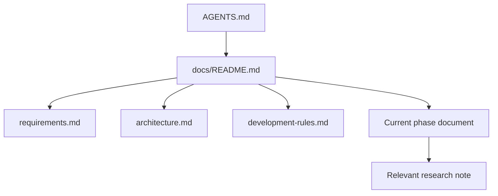

# Documentation map

`AGENTS.md` is the short entry point. Read a phase document before performing
work, and follow its **Read First** list rather than loading all documentation.

```mermaid
flowchart TD
    A[AGENTS.md] --> B[docs/README.md]
    B --> R[requirements.md]
    B --> AR[architecture.md]
    B --> D[development-rules.md]
    B --> P[Current phase document]
    P --> X[Relevant research note]
```

## Canonical sources

| Subject | Canonical document |
|---|---|
| Scope, target models, requirements, non-goals | `requirements.md` |
| Intended components, data flow, state ownership | `architecture.md` |
| Cross-cutting implementation principles | `development-rules.md` |
| OpenJev research evidence | `research/openjev.md` |
| llama.cpp and ggml research evidence | `research/llama-ggml.md` |
| Executable work plan and current findings summary | [Phase index](phases/README.md) and `phases/phase-*.md` |
| Dated implementation, benchmark, and review evidence | [Record index](records/README.md) and topic records under `records/` |
| Original unpartitioned proposal | `archive/ggml_jevlike_project_spec.md` (historical only) |

Phase documents link to canonical sources rather than duplicating them. Their
long dated execution histories live under `records/`; records are evidence,
not an additional source of current scope or requirements.
Long record sets have a phase-specific index and a directory of topic records.
Start with the phase's Read First / record routing, then read the relevant
record. Raw measurement files remain beside the record indexes.

## Roadmap

`Phase 0 → Phase 1 → Phase 2 → Phase 2+ → Phase 3 → Phase 3+ → Phase 4 → Phase 4+ → Phase 5 → Phase 6 → Phase 7`

Phase 1, Phase 2, Phase 2+, and Phase 3+ are complete; Phase 3 retains the
continuation benchmark baseline and historical measurements. Phase 3+ replaced
option-description continuation scoring with SemIf-style displayed options and
single-token answer labels. Phase 4–7 remain future planning stages; their
handoff now requires measurement-led component boundaries and request-level
parallelism/pipeline work, not candidate continuation workers.
Phase 4+ implements a sequential HTTP entry point for LAN callers. This remains
an experimental hobby project, not a tagged release or stable API.
The focused Phase 4 Vision Flash Attention plan is in
`phases/phase-4-vision-flash-attention.md`.
The Phase 4+ larger-option investigation `option-scale` was discontinued
mid-investigation on 2026-09-30; its results remain under `records/`.
The current GPU memory reduction and larger-option plan is
[`phases/phase-4-plus-option-scale-2.md`](phases/phase-4-plus-option-scale-2.md).
The [old phase document](phases/phase-4-plus-option-scale.md) records the handoff.

1. Partition documentation and establish routing.
2. Research and minimal design.
3. Sequential, single-backend implementation.
4. Harden request/result, prompt-rendering, and timing contracts.
5. Experimentation and observability.
6. Migrate to categorical answer-slot readout (Phase 3+).
7. Measurement-led component/backend boundaries.
8. Parallel full-decision/request workers when measurements justify them.
9. Request pipeline scheduler over the actual Vision/Prefill/readout stages.
10. Request-level scheduler and batch tuning.
