# Architecture

## Phase 2 execution model

```mermaid
flowchart LR
    I[Text + optional image] --> V[Vision Encoder]
    V --> P[Prefill common prefix]
    P --> S[Immutable prefix cache]
    S --> O0[Score option 0 branch]
    O0 --> R0[Rewind branch cursor]
    R0 --> O1[Score option 1 branch]
    O1 --> RN[Repeat through option N]
    RN --> N[Sum/mean + softmax]
    N --> R[Decision result]
```



Run this fully sequentially using one model, one selected backend, one request,
and 2-16 options. Vision and Prefill run once. Option branches reuse the same
prefix state but never one another's continuation state. Layer split, tensor
parallelism, workers, and the ggml multi-backend scheduler are not part of this
baseline.

## Fixed scoring contract

The common prefix contains the optional image, state, and question. It does
not contain option descriptions, option letters, or an option list. The
initial versioned prompt is conceptually:

```text
system: Use the supplied state to answer the question. Return only the answer.
user:   [optional image]
        State:
        {state}

        Question:
        {question}
model:  <continuation starts here>
```

Phase 2 must render this with Gemma 4's native turn and special tokens, not the
literal labels above. The rendered prefix and its token IDs are observable and
versioned. Tokenizing `rendered_prefix + option_description` must preserve the
prefix token IDs exactly; otherwise the request fails instead of silently
scoring a different boundary.

`Gemma4PromptRenderer` is the effective Phase 2+ prompt source. It emits the
versioned fixed renderer `gemma4-fixed-v1` for the plain Gemma 4
system/user/image/generation shape, including the direct-answer,
reasoning-disabled policy. The rendered prefix and token IDs are observable,
and the result records a stable prompt identity. `--chat-template-file` is a
reserved no-op: its exact filename is retained in metadata, never opened or
validated, and never changes the effective prompt. GGUF
`tokenizer.chat_template` is optional diagnostic metadata and is never used by
the Phase 2+ renderer.

For nonempty option tokens `o[0..m-1]`:

```text
token_logprob[i] = log_softmax(logits(prefix, o[0..i-1]))[o[i]]
sum_logprob       = sum(token_logprob)
mean_logprob      = sum_logprob / m
```

The state-final logits score `o[0]`. To score `o[i]`, the branch consumes
through `o[i-1]`. The final option token is scored but need not be consumed,
because no later option token depends on it. EOS and the model-turn terminator
are neither consumed nor scored. Thus an `m`-token option needs the Prefill
logits plus `m-1` continuation steps.

Selection is `argmax(sum_logprob)`. A stable softmax across option
`sum_logprob` values produces `relative_probability`. `mean_logprob` and token
count are returned to expose length effects but do not change selection.
Relative probabilities are conditional on the supplied option set and are not
calibrated confidence. PMI and calibration remain deferred.

## Minimum components

These are narrow Phase 2 boundaries, not framework extension points.

### `BackendContext`

- Enumerates available ggml devices and initializes exactly one requested
  backend.
- Owns the backend handle, selected buffer type, graph allocator/work buffers,
  and synchronization used for measurement and host reads.
- Allocates model, persistent state, and temporary graph buffers on that same
  backend. It does not create a backend scheduler.

### `ModelLoader`

- Reads the text GGUF and matching mmproj GGUF, validates `gemma4`/`gemma4v`,
  and builds a single `ModelBundle` from metadata and named tensors.
- Localizes E2B/E4B differences in model metadata: widths, layer counts, FFN
  sizes, KV layout, attention pattern, and vision projection width.
- Allocates weights in backend buffers and keeps quantized text weights in
  their stored ggml types. Audio tensors in the mmproj are ignored.
- Owns GGUF mappings/host metadata and the backend weight buffers for the
  lifetime of the engine.

### `VisionEncoder`

- Decodes JPEG/PNG on the host, applies the Gemma 4 dynamic-size preprocessing,
  and creates an `EncodedImage` including the patch grid and positions.
- Builds and executes the Gemma 4 Vision graph on `BackendContext` and returns
  projected `VisualTokens` whose width equals the text embedding width.
- Measures host preprocessing, required input copy, graph compute, and
  synchronization so Vision time has an explicit boundary.

### `PrefillEngine`

- Splices projected visual embeddings at the image placeholder and validates
  the context limit for the already-rendered/tokenized common prefix.
- Builds and executes the causal Gemma 4 graph, populates a `StateCache`, and
  copies the state-final logits needed for every option's first token into
  request-scoped backend storage outside the temporary graph buffer.
- Requests only the final Prefill output row. It returns a `PrefillState` after
  synchronization at the Prefill timing boundary.

### `StateCache`

- Owns backend-resident K/V storage and the logical position/sequence metadata
  for one request.
- Marks `[0, prefix_length)` immutable after Prefill. It reserves a writable
  tail for the longest option branch.
- Before each option, resets only the logical branch cursor to
  `prefix_length`. Later option steps overwrite the same tail rows. Prefix rows
  are never copied or overwritten, so branch isolation needs no full cache
  copy in the sequential baseline.
- Encodes Gemma 4's mixed sliding/full attention and shared-KV-layer layout
  behind this boundary; callers do not assume one uniform K/V tensor per layer.

### `OptionScorer`

- Boundary-tokenizes every option into `OptionTokens` before scoring begins;
  rejects empty continuations, changed prefix tokenization, or context overflow.
- For each option in input order, resets the branch cursor, gathers the target
  token's log-probability from the current full-vocabulary logits, and executes
  continuation steps only when another target token remains.
- Computes full-vocabulary log-normalization in ggml graph work and transfers
  only required scalar/token debug values to the host. It returns `OptionScore`
  with both sum and mean values.
- Records per-option score time. It never mutates the immutable prefix or uses
  another option's tail state.

### `Gemma4PromptRenderer`

- Renders the fixed `gemma4-fixed-v1` system/user/image/generation prefix and
  records `PromptFormatInfo`.
- Expresses reasoning behavior as `PromptPolicy`; Phase 2+ supports only
  direct-answer/reasoning-disabled behavior and does not invent a think-block
  terminator.
- Retains a requested template filename as metadata without opening or
  interpreting it.

### `Gemma4DecisionEngine`

- Validates one request, orchestrates Vision -> Prefill -> options in order,
  and owns request-scoped intermediate values. Model loading is outside this
  boundary.
- Calls the fixed renderer and tokenizer, boundary-tokenizes every option,
  and passes the split prefix/image spans to the existing Gemma-specific
  execution components.
- Applies stable host softmax to the 2-16 `sum_logprob` scalars. This small
  result aggregation is intentionally host-side; model tensor computation and
  vocabulary normalization remain ggml graph work.
- Preserves input order in results, selects the first maximum on an exact tie,
  and reports the tie, scoring basis, relative-probability semantics, and
  `terminator_scored=false` explicitly.
- Produces `DecisionResult` and `TimingInfo`; it does not retain request state
  after the result is returned.

## Intermediate data contracts

| Type | Required contents |
|---|---|
| `EncodedImage` | Host RGB samples after exact resize/padding/normalization preparation; width, height, patch-grid dimensions, x/y positions |
| `VisualTokens` | Backend tensor `[text_width, visual_token_count]`, element type, backend identity, image-token placement metadata |
| `OptionTokens` | Stable option ID and input index, exact description, host token IDs, token count, boundary-validation result |
| `PrefillState` | Rendered-prefix hash/version, prefix token count, image-token count, next absolute position, `StateCache`, persistent backend state-final logits |
| `OptionScore` | Option ID/index, token count, `sum_logprob`, `mean_logprob`, optional per-token log-probabilities/debug IDs, score duration |
| `DecisionRequest` | State, question, 2-16 ordered semantic options, at most one image path, prompt policy, and optional reserved template filename |
| `PromptFormatInfo` | Renderer ID/version, model family, effective source, reasoning policy, requested override/applied flag, GGUF-template diagnostic flags |
| `DecisionResult` | Ordered option scores, relative probabilities, selected ID/index, exact-tie flag, `sum_logprob` ranking/softmax basis, `terminator_scored=false`, prompt identity/metadata, timings |
| `VisionDebugInfo` | Optional host copy of projected visual tokens, populated only when explicitly requested for a debug dump |
| `TimingInfo` | Prompt rendering, tokenization, image preprocessing, Vision, Prefill, each option, score total, normalization, enclosing request total |

Host input validation additionally requires 2-16 options, unique nonempty IDs,
nonempty descriptions, a nonempty question, and a text state. The first
milestone accepts at most one image.

## Placement, copies, ownership, and lifetime

| Category | Location | Owner | Lifetime | Required copies |
|---|---|---|---|---|
| Request strings and image path | Host | `Gemma4DecisionEngine` | One request | None until token/image inputs are prepared |
| Token IDs, positions, option metadata | Host | `Gemma4DecisionEngine` / `OptionScorer` | One request | Host -> backend graph-input tensors per Prefill/step |
| Decoded/resized image samples | Host | `EncodedImage` | Through Vision input upload | Host -> selected backend once |
| Text and vision weights | Selected backend; GGUF may remain host-mapped as loading source | `ModelLoader` | Engine lifetime | Load/upload once; no per-request backend copy |
| Vision activations | Selected backend temporary graph buffers | `VisionEncoder` via `BackendContext` | One Vision call | None across backends |
| Projected visual tokens | Selected backend | Request-scoped `VisualTokens` | Until Prefill consumes them | No backend copy; do not round-trip through host |
| Prefill/continuation activations | Selected backend temporary graph buffers | `PrefillEngine` / `OptionScorer` via `BackendContext` | One graph execution | None across backends |
| Prefix and branch K/V | Selected backend persistent request buffer | `StateCache` | Prefill through last option | No prefix copy per option; tail rows are reused sequentially |
| Prefill-final vocabulary logits | Selected backend persistent request buffer | `PrefillState` | Through the last option's first-token score | Backend -> host only for requested scalar/debug output |
| Continuation-step logits/log-normalizer | Selected backend graph output | `OptionScorer` via `BackendContext` | Until that step's target scalar is extracted | Backend -> host only for requested scalar/debug output |
| Option scores and probabilities | Host | `Gemma4DecisionEngine` | Result lifetime | One scalar result per requested value |
| Optional Vision debug values | Host | `Gemma4DecisionEngine` / CLI | Result and dump lifetime | Backend -> host only when explicitly requested; file output is after request completion |

All backend work is synchronized before its timing interval ends and before a
host read. Temporary graph tensors must not outlive their graph buffer. A
`PrefillState` cannot outlive its `ModelBundle` or `BackendContext`.

## Confirmed Phase 2 sequence

1. Validate the request, render the option-free prompt, and boundary-tokenize
   every option before model work.
2. If an image exists, decode/preprocess it and run Vision on the selected
   backend, retaining projected tokens there.
3. Run Prefill once from text plus optional visual embeddings. Freeze prefix
   cache rows and retain the final output logits in request-scoped backend
   storage.
4. For each option in input order, rewind the branch cursor, accumulate exact
   causal token log-probabilities, and return sum/mean. Do not consume or score
   a terminator.
5. Compute stable softmax over sum scores, select the first maximum, and emit
   the ordered result plus timings and contract metadata.

## Later direction

Phase 4 may assign Vision, Prefill, and Logit to separate backends. Phase 5 may
fan a Prefill state out to workers, which will require explicit immutable-state
copies or shared read-only storage plus private branch buffers. Phase 6 may
pipeline requests. These future constraints do not authorize concurrency,
cross-backend copies, or scheduler use in Phase 2.
