# GGML-based Jev-like Multimodal Decision Engine
## 要求仕様・基本設計方針・開発フェーズ

> **Historical, non-normative document.** This is the original unpartitioned
> planning document. It may be outdated and must not override `AGENTS.md`,
> `docs/requirements.md`, `docs/architecture.md`, or the current phase
> document.

## 1. プロジェクト概要

本プロジェクトでは、Gemma 4 E2B / E4B をベースに、OpenJev / Jev のような「生成ではなく、与えられた状態と候補に対して意味的な判定・スコアリングを行う」推論エンジンを hobby project として実装・評価する。

主目的は、通常の autoregressive generation を行うのではなく、

- Vision Encoder による画像入力処理
- テキスト・画像状態の Prefill
- 候補ごとの logit / log-probability scoring
- 複数候補・複数 query の並列評価

を明示的に分離し、最終的には複数 backend を用いてパイプライン化・並列化できる構成へ発展させることである。

本プロジェクトでは llama.cpp の tool / example 上に実装するのではなく、**ggml を直接利用する独立プロジェクト**として構成する。

---

## 2. 用語

本計画では工程の粒度を以下のように統一する。

- **Phase**
  - 開発全体における大きな到達段階。
  - 例: 調査・設計、基本実装、backend 分離、並列化。
- **Stage**
  - 各 Phase 内の機能的・技術的なまとまり。
  - 例: OpenJev 調査、Vision Encoder 実装、scheduler 実装。
- **Step**
  - Stage 内で実際に行う具体的な作業単位。
  - Codex に実装を依頼する際の最小～中程度のタスク粒度として用いる。

原則として、

`Phase -> Stage -> Step`

の3階層で進捗を管理する。

また、実際のリポジトリでは Phase 0 で仕様を分割し、末端の実装担当モデルは原則として `AGENTS.md` と担当 Phase の文書から作業を開始する。

---

## 3. 基本要求

### 3.1 対象モデル

対象モデルは以下とする。

- Gemma 4 E2B
- Gemma 4 E4B

E2B を軽量な開発・デバッグ用、E4B をより本命に近い評価用として扱える設計が望ましい。

モデル固有処理は可能な限り共通化し、E2B / E4B の差をハードコードで拡散させない。

---

### 3.2 推論方式

通常のテキスト生成は主機能としない。

基本動作は以下とする。

1. 入力 state を構築する。
2. 必要であれば画像を Vision Encoder で処理する。
3. state を Prefill する。
4. 候補 option を scoring 用 continuation として評価する。
5. 各 option の logit / log-probability を取得する。
6. 必要に応じて score normalization を行う。
7. softmax 等で option probability を算出する。
8. 最良候補、確率分布、タイミング情報などを返す。

基本的には OpenJev 系の、

- context/state を一度 Prefill
- option 群を continuation として評価
- token generation は行わない

という思想を参考にする。

---

### 3.3 実装基盤

実装は **ggml を直接利用する独立 C / C++ プロジェクト**とする。

以下は行わない。

- llama.cpp の `examples/` 以下への追加
- llama.cpp の既存 CLI tool の改造を主実装とすること
- llama.cpp runtime API をそのまま decision engine としてラップすること

ただし以下は積極的に参照する。

- llama.cpp の Gemma 4 model 実装
- GGUF loader
- Vision Encoder 実装
- graph 構築方法
- tensor layout
- KV cache / recurrent state 管理
- backend API の使用方法
- allocator / buffer 管理
- backend scheduler の実装思想
- Vulkan / CUDA / CPU backend との接続方法

必要であればコードの一部を設計上の参考とするが、プロジェクト自体は ggml API を直接利用する。

---

### 3.4 Backend

初期実装では単一 backend のみ使用する。

対象候補:

- CPU
- CUDA
- Vulkan

最初から全 backend で完全動作させることを必須とはしない。

開発時に最も扱いやすい backend でまず動作させ、その後 ggml backend abstraction を利用して他 backend を使える構成にする。

---

### 3.5 Layer Split

通常の llama.cpp にあるような Transformer layer 単位の複数 GPU / backend split は **非対応でよい**。

本プロジェクトで扱う並列化は layer split ではなく、主に以下を対象とする。

- Vision Encoder
- Prefill
- Option / Logit scoring

の機能単位分離、および Logit worker の複数化。

---

### 3.6 優先事項

優先順位は以下。

1. 構造が理解しやすいこと
2. デバッグしやすいこと
3. 実験しやすいこと
4. backend 分離しやすいこと
5. 並列化しやすいこと
6. 十分な速度
7. 極端な最適化

hobby project のため、大規模な production 品質のテスト、完全な API 互換性、極端なエラー耐性は要求しない。

---

## 4. 非目標

少なくとも初期段階では以下を非目標とする。

- 一般用途 chat completion
- 長文 autoregressive generation
- llama.cpp API 互換性
- OpenAI API 互換 server
- layer split
- tensor parallel
- distributed inference
- 複数 node 間分散
- training / fine-tuning
- 大規模 benchmark suite
- production-grade fault tolerance
- 完全な Jev API 再現
- Jev 内部構造そのものの再現

本プロジェクトは、Jev-like な **decision inference engine** の PoC を目的とする。

---

# 5. 全体アーキテクチャ案

最終的な論理構造は以下を想定する。

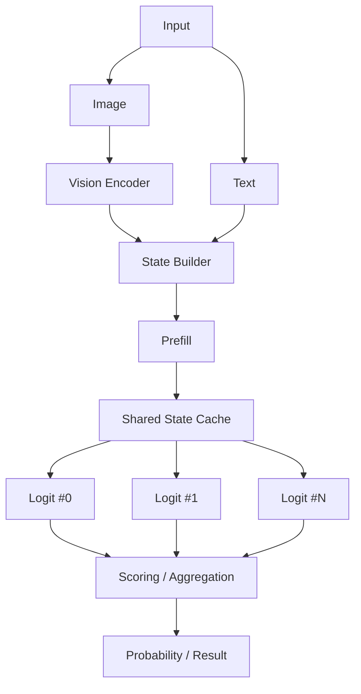

初期版ではすべてを1 backend上で逐次実行する。

最終版では、

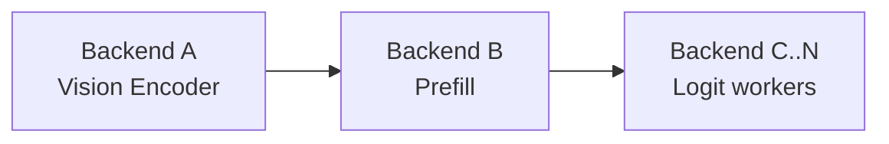

のように役割単位で分離できる構成を目指す。

---

# 6. Phase 0 - 仕様分割・AGENTS.md 作成

## 目的

最初の作業では実装や upstream 調査を開始しない。

まず本仕様書を、Terra / Luna 等の比較的小さな実装担当モデルでも必要な情報だけを読める構造へ分割し、リポジトリ直下に `AGENTS.md` を作成する。

この Phase の目的は、以後の Codex 作業において毎回この巨大な仕様書全体を context に入れなくても、担当 Stage / Step に必要な制約・設計・参照先へ到達できるようにすることである。

`AGENTS.md` は全仕様のコピーではなく、**短い入口・ルーティング文書**とする。

---

## Stage 0.1 - 仕様書の分割方針決定

### Step 0.1.1

この master specification を読み、内容を以下のような責務単位へ分割する。

推奨構成:

```text
AGENTS.md
docs/
  README.md
  requirements.md
  architecture.md
  development-rules.md
  research/
    openjev.md
    llama-ggml.md
  phases/
    phase-1-research-design.md
    phase-2-single-backend.md
    phase-3-evaluation-debug.md
    phase-4-backend-separation.md
    phase-5-logit-workers.md
    phase-6-pipeline-scheduler.md
    phase-7-scheduler-tuning.md
```

実際のファイル名はリポジトリ構造に合わせて変更してよいが、1つの巨大文書へ戻さないこと。

### Step 0.1.2

重複情報を整理し、「canonical source」を決める。

例:

- プロジェクト全体の要求: `docs/requirements.md`
- architecture と component 関係: `docs/architecture.md`
- 共通実装規則: `docs/development-rules.md`
- OpenJev 調査結果: `docs/research/openjev.md`
- llama.cpp / ggml 調査結果: `docs/research/llama-ggml.md`
- 各 Phase の実行手順: `docs/phases/phase-*.md`

同じ要求を複数ファイルへ完全コピーしない。

---

## Stage 0.2 - AGENTS.md 作成

### Step 0.2.1

リポジトリ直下に `AGENTS.md` を作る。

`AGENTS.md` は末端の実装担当モデルが最初に読むファイルとして、短く保つ。

最低限以下を含める。

- このプロジェクトの目的を数行
- E2B / E4B 前提
- ggml を直接使い、llama.cpp tool/example/runtime wrapper として実装しないこと
- layer split は対象外であること
- sequential-first の原則
- llama.cpp は reference implementation として調査すること
- 現在の Phase / Stage を確認してから作業すること
- 担当 Step に必要な docs だけを読むこと
- 不明な仕様を勝手に拡張せず canonical doc を確認すること
- 実装変更時に関連 docs を必要最小限更新すること
- 大掛かりな framework / abstraction / test suite を勝手に導入しないこと

### Step 0.2.2

`AGENTS.md` に docs routing table を置く。

例:

| 作業内容 | 最初に読む文書 |
|---|---|
| 全体要求を確認 | `docs/requirements.md` |
| component / data flow | `docs/architecture.md` |
| 実装規約 | `docs/development-rules.md` |
| OpenJev方式を調査 | `docs/research/openjev.md` |
| llama.cpp / ggmlを調査 | `docs/research/llama-ggml.md` |
| 現在Phaseの作業 | 対応する `docs/phases/phase-*.md` |

### Step 0.2.3

`AGENTS.md` に「作業開始時の読み方」を明記する。

推奨:

1. `AGENTS.md` を読む。
2. 指定された Phase / Stage / Step を確認する。
3. routing table から必要な文書だけ読む。
4. 関係しない後続 Phase の詳細は読まない。
5. 変更対象の source と upstream reference を確認する。
6. 小さな変更単位で実装・確認する。

末端モデルにこの master specification 全体を毎回読ませることを前提にしない。

---

## Stage 0.3 - Phase 文書への分割

### Step 0.3.1

本書の Phase 1 以降を `docs/phases/` 以下へ分割する。

各 Phase 文書は最低限以下の構造に統一する。

```text
# Phase N - Name

## Goal
## Prerequisites
## Read First
## Stages
### Stage N.x
#### Step N.x.y
## Deliverables
## Completion Criteria
## Notes / Findings
```

### Step 0.3.2

各 Phase の `Read First` では、その Phase に本当に必要な docs のみを列挙する。

たとえば基本実装担当に scheduler tuning の仕様を先読みさせない。

### Step 0.3.3

各 Phase 文書に `Notes / Findings` を用意し、調査・実装で判明した事実を次の担当モデルが拾えるようにする。

---

## Stage 0.4 - Master 文書の扱い

### Step 0.4.1

本 master specification は、分割後には以下のどちらかにする。

- 全体 roadmap / index として短く再構成する
- `docs/archive/` 等へ保存し、通常作業では参照しない

末端モデルの通常導線からは外す。

### Step 0.4.2

`docs/README.md` から、

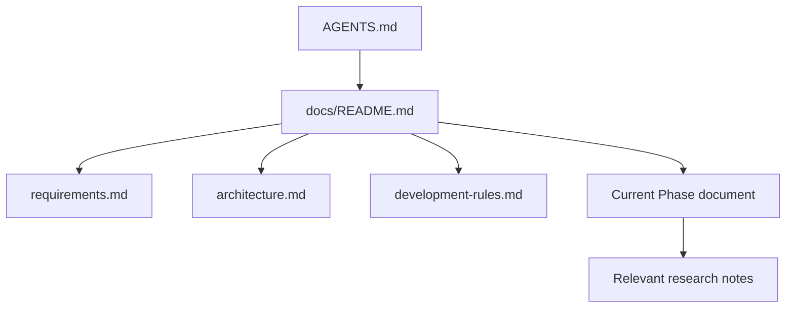

のように文書構造を辿れるようにする。

---

## Phase 0 完了条件

- `AGENTS.md` が存在する
- master specification が責務単位に分割されている
- 各要求の canonical source が明確である
- 各 Phase が独立した文書として読める
- `AGENTS.md` だけで担当モデルが読むべき文書へ到達できる
- 以後、末端モデルが巨大な master specification 全体を読む必要がない
- Phase 1 の調査担当へ明確に handoff できる

---

# 7. Phase 1 - 調査・基本設計

## 目的

いきなり実装を開始せず、OpenJev の scoring 方式と llama.cpp 内部の Gemma 4 / multimodal / ggml graph 実装を確認し、本プロジェクトに必要な最小構成を設計する。

この Phase の成果物は「動くコード」よりも **実装方針が固まっていること**を重視する。

---

## Stage 1.1 - OpenJev の調査

### Step 1.1.1

OpenJev の現在の scoring ロジックを確認する。

最低限確認する項目:

- state / context の prompt 化
- option の tokenization
- option が single-token / multi-token の場合の扱い
- direct scoring
- shared state / shared prefix
- serial mode
- option batch
- log-probability accumulation
- length normalization
- mean / sum / PMI 等の normalization
- softmax
- confidence 算出方法
- option order dependency
- timing 計測

### Step 1.1.2

OpenJev の方式から、本プロジェクトで最初に再現すべき最小 scoring 方式を決める。

初期候補:

```text
score(option)
  = sum(log P(token_i | state, option_<i))
```

必要に応じて、

```text
mean_logprob
  = score(option) / n_tokens
```

も実装する。

PMI 等は後回しでもよい。

---

## Stage 1.2 - llama.cpp / ggml 内部調査

### Step 1.2.1

Gemma 4 E2B / E4B のモデル実装を確認する。

確認対象:

- model tensor 構成
- embedding
- Transformer block
- attention
- RoPE
- final normalization
- output projection
- logits 生成

### Step 1.2.2

Vision Encoder の実装を確認する。

確認対象:

- image preprocessing
- image tensor layout
- patch embedding
- Vision Transformer
- projector
- visual token の生成
- LLM token sequence への接続方法

### Step 1.2.3

Prefill / decode graph の差を確認する。

確認対象:

- graph build
- KV cache
- position
- sequence handling
- batch
- output selection

### Step 1.2.4

ggml backend API を確認する。

確認対象:

- backend enumeration
- backend init
- buffer type
- tensor allocation
- graph allocation
- graph compute
- async compute
- synchronize
- tensor copy
- event

### Step 1.2.5

ggml backend scheduler を確認する。

ただし、この Phase では scheduler をそのまま採用すると決めない。

確認したい点:

- graph split の考え方
- backend assignment
- buffer ownership
- backend 間 tensor copy
- async compute
- synchronization
- scheduler が本プロジェクトに利用可能か
- 独自 scheduler の方が単純か

---

## Stage 1.3 - 基本設計

### Step 1.3.1

主要 component の interface を決める。

最低限以下を分離する。

```text
ModelLoader
VisionEncoder
PrefillEngine
StateCache
OptionScorer
BackendContext
DecisionEngine
```

### Step 1.3.2

中間データ構造を定義する。

例:

```text
EncodedImage
VisualTokens
PrefillState
OptionTokens
OptionScore
DecisionResult
TimingInfo
```

### Step 1.3.3

backend ownership を明示する。

各 tensor について、

- どの backend に存在するか
- host 側に存在するか
- copy が必要か
- lifetime はどこまでか

を追跡可能な設計にする。

### Step 1.3.4

Phase 2 で使う基本 execution flow を確定する。

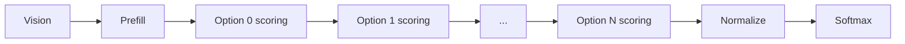

この時点では完全逐次実行でよい。

---

## Phase 1 完了条件

以下が文章または設計メモとして説明できること。

- OpenJev がどのように option を score しているか
- llama.cpp が Gemma 4 Vision / Prefill / logits をどう実装しているか
- ggml だけで再構成する場合に必要な component
- tensor / cache の ownership
- Phase 2 の execution flow

---

# 8. Phase 2 - 単一 Backend 基本実装

## 目的

Vision Encoder、Prefill、Logit scoring をすべて同じ backend に配置し、逐次実行する最小動作版を完成させる。

この Phase では並列化を考えすぎない。

まず正しく動き、挙動を観察できることを優先する。

---

## Stage 2.1 - プロジェクト基盤

### Step 2.1.1

独立 CMake project を作成する。

想定:

```text
project/
  CMakeLists.txt
  src/
  include/
  tests/
  tools/
  third_party/
  docs/
```

### Step 2.1.2

ggml を dependency として組み込む。

### Step 2.1.3

backend の列挙・選択・初期化を実装する。

最低限:

```text
--backend cpu
--backend cuda
--backend vulkan
```

のような指定を想定する。

---

## Stage 2.2 - GGUF / Model Load

### Step 2.2.1

Gemma 4 E2B / E4B GGUF を読み込む。

### Step 2.2.2

必要 tensor を名前から取得する。

### Step 2.2.3

quantized tensor をそのまま ggml graph から利用できるようにする。

### Step 2.2.4

E2B / E4B の model metadata 差を吸収する。

---

## Stage 2.3 - Tokenizer

### Step 2.3.1

Gemma 4 tokenizer を利用可能にする。

### Step 2.3.2

state と option の tokenization を実装する。

### Step 2.3.3

option の token 数と token ID を debug dump 可能にする。

---

## Stage 2.4 - Vision Encoder

### Step 2.4.1

画像読み込みと preprocessing を実装する。

### Step 2.4.2

Vision graph を構築する。

### Step 2.4.3

Vision Encoder を同一 backend 上で実行する。

### Step 2.4.4

visual token / embedding を取得する。

### Step 2.4.5

LLM Prefill へ接続できる形式へ変換する。

---

## Stage 2.5 - Prefill

### Step 2.5.1

text + visual tokens から Prefill graph を構築する。

### Step 2.5.2

KV cache 相当の state を保持する。

### Step 2.5.3

state を一度 Prefill し、その後 option scoring で再利用できるようにする。

### Step 2.5.4

Prefill timing を計測する。

---

## Stage 2.6 - Option Scoring

### Step 2.6.1

single-token option scoring を実装する。

### Step 2.6.2

multi-token option scoring を実装する。

### Step 2.6.3

log-probability accumulation を実装する。

### Step 2.6.4

以下を最低限用意する。

- sum
- mean

### Step 2.6.5

softmax により option probability を算出する。

---

## Stage 2.7 - CLI PoC

例えば以下程度の入力を扱えるようにする。

```text
jevggml \
  --model gemma4-e2b-q4.gguf \
  --image test.jpg \
  --state "Look at the image." \
  --question "What object is on the table?" \
  --option "cup" \
  --option "phone" \
  --option "book"
```

出力例:

```text
cup    score=-1.24  p=0.82
phone  score=-3.81  p=0.06
book   score=-2.91  p=0.12

selected: cup

timing:
  vision:  xx ms
  prefill: xx ms
  score:   xx ms
  total:   xx ms
```

---

## Phase 2 完了条件

- E2B または E4B GGUF をロードできる
- 画像入力を処理できる
- state Prefill が動作する
- option scoring が動作する
- multi-token option を扱える
- probability を返せる
- timing を確認できる
- 単一 backend 上で全処理が完結する

---

# 9. Phase 3 - 基本版の実験・デバッグ

## 目的

Phase 2 の基本版を実際に使い、性能・精度・挙動上の問題を把握する。

大掛かりな benchmark や test suite は作らず、hobby project として十分な範囲で試す。

---

## Stage 3.1 - 基本動作確認

### Step 3.1.1

テキストのみの decision を試す。

### Step 3.1.2

画像 + decision を試す。

### Step 3.1.3

single-token / multi-token option の差を見る。

### Step 3.1.4

option 順序を変更し結果の変化を見る。

---

## Stage 3.2 - Quantization 比較

手元で現実的な範囲で、

- Q4
- Q5
- Q6
- Q8
- F16/BF16 が利用可能なら reference

を比較する。

評価対象:

- selected option
- probability distribution
- logit gap
- 実行時間
- memory usage

精密 benchmark は不要。

---

## Stage 3.3 - Performance 観察

最低限以下を個別計測する。

```text
image preprocessing
Vision Encoder
Prefill
option scoring
normalization
backend synchronization
backend copy
total
```

特に、

```text
Vision
Prefill
Logit
```

の時間比率を把握する。

これは後の backend 分離・scheduler 設計に利用する。

---

## Stage 3.4 - Debug Support

以下の dump を必要に応じて追加する。

- token IDs
- option token length
- tensor shape
- tensor type
- backend placement
- graph node count
- intermediate timing
- logits
- raw option logprob
- normalized score
- probability

---

## Stage 3.5 - 小規模 fixture

巨大な test suite は不要だが、数個～数十個程度の fixture を用意する。

例:

```text
text/simple
text/ambiguous
vision/object
vision/state
vision/order_bias
vision/multi_token
```

目的は regression 検出と手動比較。

---

## Phase 3 完了条件

- 基本版が安定して動く
- 主要なボトルネックが把握できている
- option scoring の挙動が理解できている
- quantization による傾向がある程度わかる
- backend 分離へ進んでもよい状態になっている

---

# 10. Phase 4 - Component / Backend 分離

## 目的

Vision、Prefill、Logit を異なる backend へ配置可能にする。

この Phase の主眼は並列化ではなく、**分離可能な architecture を完成させること**。

---

## Stage 4.1 - Backend Context 抽象化

### Step 4.1.1

component が直接 global backend を参照しないようにする。

例:

```text
VisionBackend
PrefillBackend
LogitBackend
```

### Step 4.1.2

各 backend が独立した、

- backend handle
- buffer allocator
- compute buffer
- temporary buffer
- synchronization

を持てるようにする。

---

## Stage 4.2 - Vision 分離

### Step 4.2.1

Vision Encoder を専用 backend に配置する。

### Step 4.2.2

Vision 出力を Prefill backend に転送する。

### Step 4.2.3

backend 間 copy timing を測る。

---

## Stage 4.3 - Prefill 分離

### Step 4.3.1

Prefill を専用 backend に配置する。

### Step 4.3.2

Prefill 後の scoring に必要な state を定義する。

### Step 4.3.3

Logit backend に何を渡すべきか決める。

候補:

- KV cache 全体
- 必要部分のみ
- hidden state
- model-specific reusable state

ここは Phase 1 / Phase 3 の調査結果をもとに決定する。

---

## Stage 4.4 - Logit 分離

### Step 4.4.1

OptionScorer を独立 backend に配置可能にする。

### Step 4.4.2

Prefill backend -> Logit backend の state transfer を実装する。

### Step 4.4.3

単一 Logit backend で逐次 scoring を動かす。

---

## Stage 4.5 - Transfer / Synchronization

以下を明示的に管理する。

```text
VisionDone
PrefillReady
LogitReady
LogitDone
```

同期方法として、

- backend synchronize
- event
- async copy

を必要に応じて利用する。

初期実装では同期的でもよい。

---

## Phase 4 完了条件

以下が自由に指定できる。

```text
Vision = backend A
Prefill = backend B
Logit = backend C
```

例:

```text
Vision  -> CUDA0
Prefill -> CUDA0
Logit   -> CPU
```

または、

```text
Vision  -> Vulkan0
Prefill -> CUDA0
Logit   -> CUDA1
```

等。

layer split は行わない。

---

# 11. Phase 5 - 複数 Logit Worker

## 目的

Logit scoring 部を複数 backend / worker へ拡張し、複数 option や複数 decision query を並列評価できるようにする。

---

## Stage 5.1 - Logit Worker Model

以下のような worker abstraction を導入する。

```text
LogitWorker
  backend
  model state
  work queue
  input buffer
  output buffer
  status
```

複数 worker:

```text
LogitWorker[0]
LogitWorker[1]
...
LogitWorker[N-1]
```

---

## Stage 5.2 - Job Model

最低限以下の job を定義する。

```text
DecisionJob
OptionScoreJob
```

例:

```text
DecisionJob
  state_id
  question_id
  options[]
```

内部で、

```text
OptionScoreJob(option_0)
OptionScoreJob(option_1)
...
```

へ分割可能にする。

---

## Stage 5.3 - Basic Scheduler

最初の scheduler は単純でよい。

候補:

```text
Round Robin
```

または、

```text
first available worker
```

から開始する。

---

## Stage 5.4 - Batched Scoring

backend / model に応じて、

```text
option 0
option 1
option 2
...
```

を個別 job とするだけでなく、

```text
option batch
```

として一つの graph へまとめる方式も実験する。

比較対象:

```text
many small graphs
vs
one batched graph
```

---

## Stage 5.5 - Shared State Fan-out

Prefill state を複数 Logit worker へ配布する。

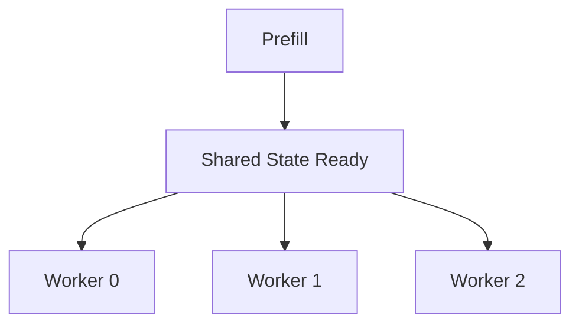

state copy のコストを測定する。

必要であれば worker 側に persistent cache を持つ。

---

## Phase 5 完了条件

- Logit worker を複数生成できる
- option scoring job を分配できる
- 複数 backend 上で同時実行できる
- 結果を集約できる
- single worker / multi worker を切り替えられる

---

# 12. Phase 6 - Pipeline Scheduler

## 目的

Vision / Prefill / Logit を独立 stage として扱い、複数 request を pipeline 処理できる scheduler を作る。

---

## Stage 6.1 - Pipeline Model

論理 pipeline:

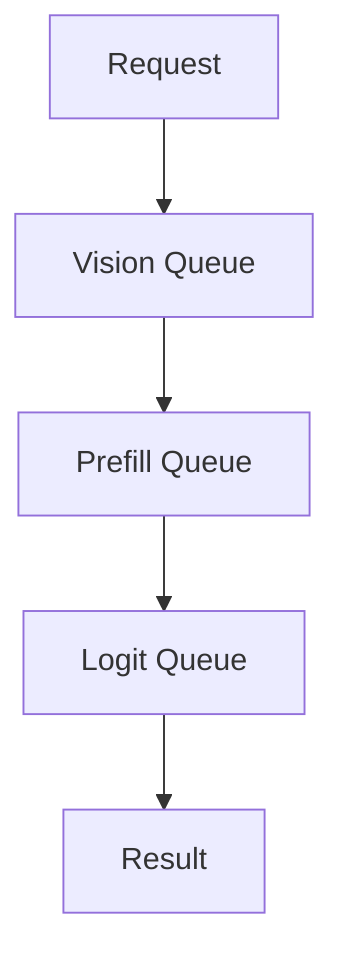

---

## Stage 6.2 - Request State Machine

例:

```text
Queued
VisionRunning
VisionDone
PrefillRunning
PrefillDone
LogitRunning
Completed
Failed
```

---

## Stage 6.3 - Async Execution

可能であれば、

- backend async graph compute
- backend event
- async tensor copy

を利用する。

ただし最初は thread + synchronize でもよい。

---

## Stage 6.4 - Overlap

以下のような overlap を可能にする。

```mermaid
gantt
    title Pipeline overlap example
    dateFormat X
    axisFormat %s

    section Request A
    Vision A  :a1, 0, 3
    Prefill A :a2, after a1, 5
    Logit A   :a3, after a2, 2

    section Request B
    Vision B  :b1, 3, 3
    Prefill B :b2, after b1, 5
    Logit B   :b3, after b2, 2
```

さらに、

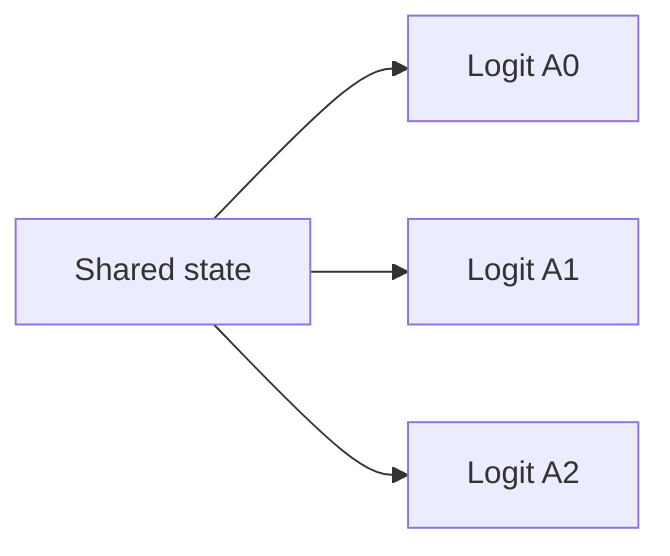

を複数 worker で実行する。

---

# 13. Phase 7 - Scheduler Tuning

## 目的

最終段階として、手元の hardware で throughput / latency が良くなるよう scheduler を調整する。

production-grade optimization は不要。

---

## Stage 7.1 - Timing Collection

scheduler が以下の moving average を保持する。

```text
Vision latency
Prefill latency
Logit latency
backend copy latency
queue wait
```

---

## Stage 7.2 - Worker Weight

backend ごとに性能差がある場合、

```text
CUDA0 = 3
CUDA1 = 2
CPU   = 1
```

のような単純 weight を導入してもよい。

---

## Stage 7.3 - Queue Policy

比較候補:

- FIFO
- shortest queue
- least estimated completion time
- backend affinity
- state cache affinity

---

## Stage 7.4 - Batch Policy

以下を tuning parameter にする。

```text
max option batch
max wait time
max queued jobs
```

小さな request は低 latency で処理し、大量 option は batch 化するなどの trade-off を試す。

---

## Stage 7.5 - Cache Policy

必要に応じて、

- Vision result cache
- Prefill state cache
- Logit worker local state cache

を検討する。

hobby project なので高度な eviction policy は不要。

---

## Phase 7 完了条件

- 複数 request を pipeline 処理できる
- Logit worker を複数利用できる
- backend の速度差を考慮できる
- scheduler parameter を変更して性能比較できる
- 手元環境で納得できる設定を見つけられる

---

# 14. 開発順序まとめ

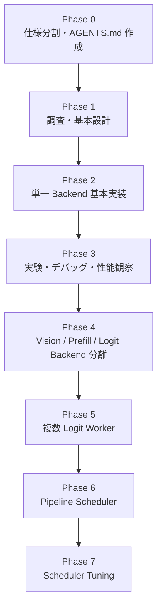

重要なのは、

**Phase 2 で並列化を始めないこと。**

まず完全逐次版を動かし、

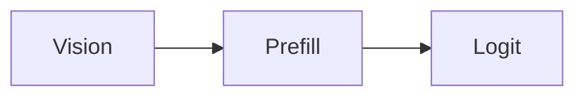

それぞれのコスト・データ依存・tensor lifetime を理解したうえで分離する。

---

# 15. Codex に対する実装方針

Codex には、いきなり全体を実装させず、原則として Stage または Step 単位で作業させる。

特に Phase 1 ではコード変更より調査を優先する。

例:

```text
Phase 1 / Stage 1.1 を実施してください。

OpenJev の current implementation を確認し、
state prefill と option scoring の処理を追跡してください。

以下をまとめてください。

- relevant source files
- call flow
- tensor shapes
- KV cache handling
- option batching
- multi-token scoring
- normalization
- timing

この段階ではコード変更を行わないでください。
```

次に、

```text
Phase 1 / Stage 1.2 を実施してください。

llama.cpp current source の Gemma 4 E2B/E4B と
Vision implementation を調査してください。

本プロジェクトでは llama.cpp runtime API は利用せず、
ggml を直接利用します。

その前提で再実装に必要な処理を整理してください。
```

のように進める。

---

# 16. 実装上の設計原則

## 15.1 Graph-first

処理は可能な限り ggml graph として表現する。

host C++ で不要な tensor 演算を行わない。

---

## 15.2 Backend-aware

tensor が、

```text
どこに存在するか
誰が所有するか
どこへコピーされるか
```

を常に追跡可能にする。

---

## 15.3 Sequential First

最適化前に逐次版を完成させる。

---

## 15.4 Observable

性能問題を推測だけで判断しない。

最低限、

```text
Vision
Prefill
Logit
Copy
Sync
```

を個別計測する。

---

## 15.5 Avoid Premature Abstraction

将来の分散実行を想定した巨大 framework を最初から作らない。

まず、

```text
1 model
1 backend
1 request
N options
```

を完成させる。

---

## 15.6 llama.cpp Is a Reference

llama.cpp のコードは非常に重要な reference implementation として利用する。

ただしプロジェクト構造・runtime architecture までそのままコピーすることを目的としない。

必要な処理を理解し、

```text
Gemma 4
+
Vision
+
Prefill
+
Decision Scoring
```

に必要な部分だけを再構成する。

---

# 17. 最初の実用目標

最初の milestone は、以下が動くこと。

```text
Input:
  JPEG/PNG image
  text state
  question
  2-16 options

Model:
  Gemma 4 E2B Q4/Q5 GGUF

Backend:
  one backend

Output:
  option raw scores
  option normalized scores
  probabilities
  selected option
  Vision / Prefill / Logit timing
```

E2B でこれを完成させた後、E4B で同じコードが動くことを確認する。

---

# 18. 将来的な実験候補

必須ではないが、基本構成完成後に以下を試してもよい。

- option order sensitivity
- repeated permutation voting
- PMI scoring
- calibrated probability
- learned decision head
- LoRA / QLoRA
- vision embedding reuse
- state cache reuse
- multi-question shared prefill
- batch vs worker parallelism
- heterogeneous GPU scheduling
- CPU + GPU mixed scheduling
- Vulkan + CUDA mixed scheduling
- remote ggml backend
- diffusion-style iterative decision refinement

---

# 19. 参照対象

実装開始時には少なくとも以下を確認する。

- OpenJev
  - https://github.com/TheoLeeCJ/openjev
- alternative OpenJev-style implementation / one-pass option scoring reference
  - https://github.com/daseinlabs/open-jev
- llama.cpp
  - https://github.com/ggml-org/llama.cpp
- ggml backend API
  - `ggml/include/ggml-backend.h`
- llama.cpp Gemma 4 implementation
  - Gemma 4 model implementation
  - Gemma 4 GGUF conversion code
- llama.cpp multimodal / Vision implementation
- llama.cpp graph / backend scheduler implementation

参照する upstream code は更新が速いため、Codex に調査させる際は可能であれば commit hash を記録する。

---

# 20. 最終目標

最終的には、

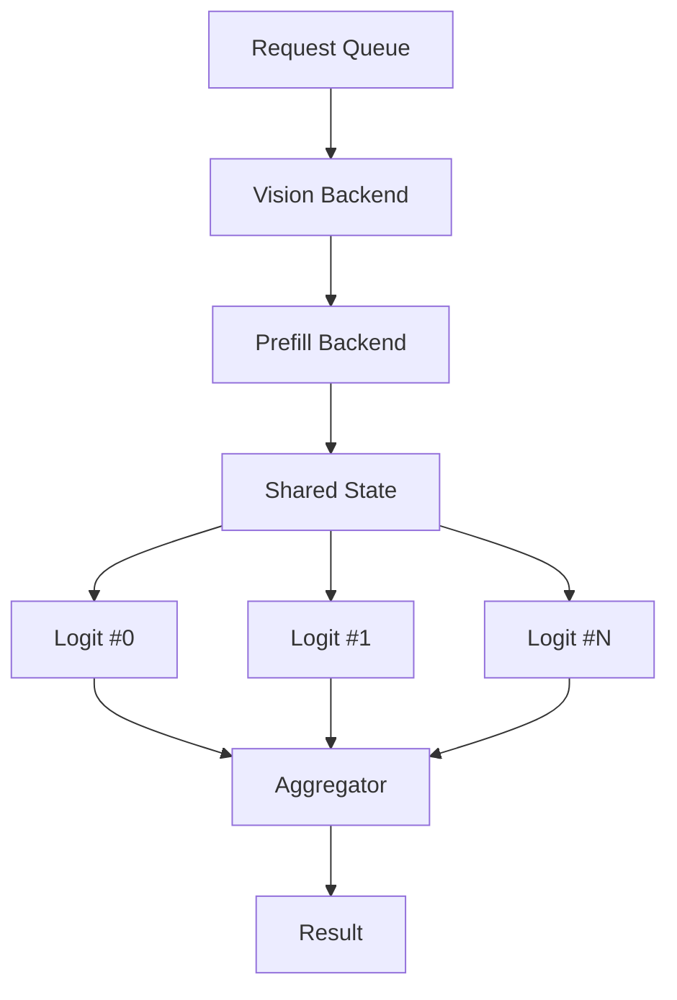

という、Jev-like な multimodal decision inference pipeline を ggml 上で構築する。

重要なのは最高性能そのものではなく、

- decision inference を明示的にモデル化できること
- Vision / Prefill / Logit を独立して観察できること
- backend を役割単位で分離できること
- Logit 部を複数並列化できること
- scheduler の挙動を自分で実験・変更できること

である。
