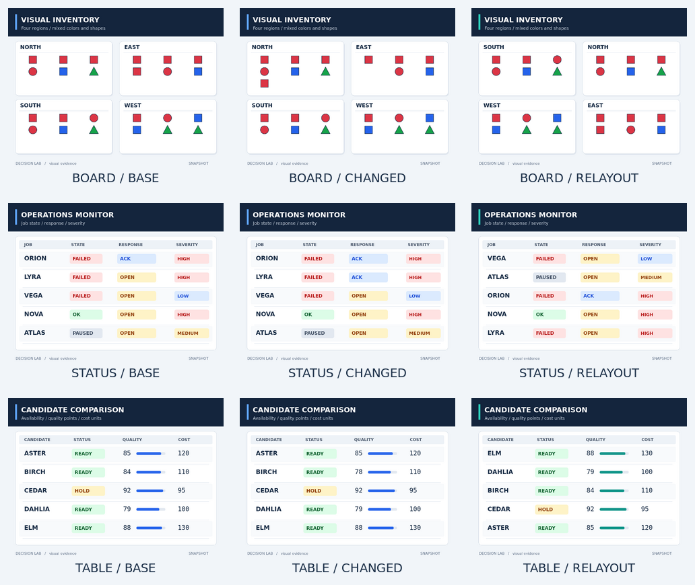

# Step 4: structured visual evidence

[`../phase4-step4-vision.jsonl`](../phase4-step4-vision.jsonl) supplies 9 RGB PNG
images and 27 categorical requests. Each image has a base candidate order,
reversed candidates, and two unrelated options added. Candidate counts are
4–8, within the current A–P contract. Original semantic IDs and descriptions
are preserved.

| Family | Rule | Base answer | Evidence change / new answer | Relayout answer |
|---|---|---|---|---|
| Board | Count only red squares within each printed region | `east` (4) | Move one red square from EAST to NORTH → `north` (4) | `east` |
| Status | FAILED and OPEN, then highest severity | `lyra` | LYRA response OPEN → ACK → `vega` | `lyra` |
| Table | READY and quality ≥80, then lowest cost | `birch` | BIRCH quality 84 → 78 → `aster` | `birch` |

At the same candidate order, all three visual variants have identical state,
question, and option descriptions. The changed image supplies the only new
evidence. Relayout moves named cards or table rows and changes decorative
colors while preserving the evidence and answer. Compare semantic IDs, since
candidate reversal changes answer labels.

Expected IDs and reasons are fixed from the source facts before inference.
The production benchmark reader ignores the evaluation metadata and does not
place expected answers or source facts in the prompt. Image paths resolve
relative to the input JSONL. `contact-sheet.png` is a preview only; feed the
individual images through the JSONL.

## Regeneration and verification

From the repository root:

```sh
python3 fixtures/phase4-step4-vision/generate.py
```

Rendering uses ImageMagick (`convert`/`montage` or `magick`) and DejaVu Sans,
Sans Bold, and Sans Mono. Python uses only its standard library to orchestrate
rendering and derive answers. [`manifest.json`](manifest.json) contains source
facts, relationships, dimensions, tool version, and SHA-256 hashes. Repeated
generation matched all image and fixture hashes with ImageMagick 6.9.12-98;
different font or ImageMagick versions can change rasterization and hashes.

Each evidence image is 960×720. The production decoder and preprocessor
accepted all images with the local E2B/E4B mmproj configurations: unchanged
960×720 prepared size, 2,700 patches, and 300 visual tokens. File and encoded-byte
inputs produced identical finite normalized tensors. The production renderer
and answer boundary checks passed all 27 rows for E2B/E4B BF16/Q4; their token
and answer ID sequences matched. Pixel differences for changed images were
confined to the moved object or edited cell. These checks validate inputs.
E4B BF16/Q4 and E2B BF16/Q4 CPU semantic screens are recorded in the
[Step 4 model comparison](../../docs/records/phase-4-plus-option-scale-2/vision-screening.md#vision-multi-model-cpu-comparison-2026-10-01).

## Image-fact text controls

[`../phase4-step4-vision-text-controls.jsonl`](../phase4-step4-vision-text-controls.jsonl)
contains five text-only controls corresponding to the selected board, status,
and table requests. Each row keeps the same question and option IDs, descriptions,
and order, while replacing the image with a literal transcription of its visible
facts. The transcription does not name the correct choice. `expected_selected_id`,
`expected_reason`, and source-image metadata are evaluation metadata; the benchmark
reader does not place them in the prompt. These rows help separate fact extraction
from applying the text rule, but do not replace the image fixtures.

The E4B Q4 CPU comparison against the local llama.cpp reference, including exact
shared-embedding prefill, the normal mtmd image path, and these text controls, is
recorded in the
[reference/control results](../../docs/records/phase-4-plus-option-scale-2-vision-reference-controls-e4b-q4-cpu-2026-10-01.jsonl).
This diagnostic covers five selected requests only. The later full 27-row E4B
BF16/Q4 shared-embedding comparison is summarized below. CUDA comparisons and
optimized-path adoption remain pending.

## Evaluation scope

Treat this as 3 task families, 6 distinct evidence scenarios, and 3 layout
derivatives. The 27 requests are correlated transformations, not 27 independent
accuracy samples. Report base accuracy, whether evidence changes cause the
expected selection changes, and whether relayout/reversal/distractors preserve
the expected semantic selection. Record top-two logit margins separately:
visual complexity does not establish numerical near-ties.

For Step 4 weight A/B, hold token IDs, candidate order, and visual embeddings
fixed between BF16 and Q4. Measure encoder differences separately in an
end-to-end comparison. CPU and CUDA results remain separate. The original
numeric controls and simpler quality set retain their historical inputs.
Validation details are in the
[`option-scale-2 records`](../../docs/records/phase-4-plus-option-scale-2/vision-screening.md#step-4-structured-vision-fixtures).



2026-10-01の境界修正以降、rendererは`<|image><|image|><image|>`を明示する。
中央markerのみをvisual embeddingsへ置換し、境界2tokenは通常textとして保持する。
修正前のCPU raw結果は境界なし入力の歴史的測定として保持し、新測定とは区別する。

2026-10-01追加レビュー対応: 修正後の画像境界契約で、E4B BF16/Q4の全27条件を
同じ保存300×2560 embedding・同じCPU reference経路（通常buffer、LLAMAFILE/tiled OFF、
F32 KV、通常attention、full SWA、512上限）で比較した。両方13/27正解だがwinnerは3件変化、
正解→誤答と誤答→正解は各1件。branchscore非padding経路12/27との選択差はboard-baseのみ。
診断用にkey軸paddingを揃えた画像5条件ではreferenceの全候補logitsとF32一致したが、
全27条件のproduction結果やCUDAの保証とはしない。
[全27条件shared-embedding記録](../../docs/records/phase-4-plus-option-scale-2-vision-shared-reference-e4b-cpu-2026-10-01.jsonl)と
[CPU kernel/key軸診断](../../docs/records/phase-4-plus-option-scale-2/cpu-kernel-padding-baseline.md#cpu-kernel-alignment-2026-10-01)を参照する。
